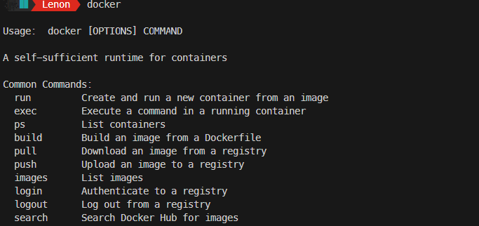

# Installing Docker: What You Need to Know

Now that we’ve learned what Docker is, what containers are, and why they’re useful, it’s time to install Docker so you can start using it. The installation process varies depending on your operating system and its system requirements, so let’s break it down step by step.

---

## Where to Start

To install Docker, the best place to begin is the [official Docker website](https://www.docker.com/products/docker-desktop/).

- Navigate to **Developer Docs > Download and Install Docker**.
- Select your operating system to see the system requirements and installation instructions.

---

## System Requirements

Here are the basic requirements for running Docker:

### macOS

- **Hardware**: Newer than 2010.  
- **macOS Version**: 10.14 or later.  
- **Installation Tool**:  
  - Use **Docker Desktop** if your system meets the requirements.  
  - Otherwise, use **Docker Toolbox** (an older tool for unsupported systems).  

---

### Windows

- **Versions**: Windows 10 Pro, Enterprise, Education, or Home.  
- **Installation Tool**:  
  - Use **Docker Desktop** if compatible.  
  - Use **Docker Toolbox** for older systems.

---

### Linux

- **Requirements**: Most Linux systems natively support Docker, so no special tools like Docker Desktop or Toolbox are needed.  
- **Installation Method**: Directly install the **Docker Engine**.

---

## Tools for Installation

- **Docker Desktop**: The recommended tool for both macOS and Windows. It simplifies Docker installation and management.  
- **Docker Toolbox**: An older tool for systems that don’t support Docker Desktop. Use this only if necessary.  
- **Linux**: You don’t need Docker Desktop or Toolbox. Install the Docker Engine directly as Linux natively supports containers.

---

# Installing Docker

### macOS

1. Check system requirements.
2. Install **Docker Desktop** if supported.  
3. If unsupported, install **Docker Toolbox**.

---

### Windows

1. Check system requirements.
2. Install **Docker Desktop** if supported.  
3. If unsupported, install **Docker Toolbox**.

---

### Linux

1. Install the **Docker Engine** directly from the Linux repository.  
2. This process is straightforward and doesn’t require additional tools.

---

## Step 1: [Determine Your Windows Version](https://docs.docker.com/desktop/setup/install/windows-install/#system-requirements)

### Docker Desktop Requirements

- **Supported Versions**:  
  - Windows 10 Pro, Enterprise, Education, or Home.  
- **Older Versions**:  
  - For Windows 7 or 8, use **Docker Toolbox**.
- **Recommendation**:  
  - If possible, upgrade to Windows 10 for **Docker Desktop** compatibility.

---

## Step 2: Enable Necessary Features

### Windows 10 Pro, Enterprise, or Education

- **Enable Hyper-V and Containers**:
  1. Open **PowerShell** as Administrator.
  2. Run commands to enable both features (detailed instructions available online).

---

### Windows 10 Home

- **Enable WSL 2 (Windows Subsystem for Linux)**:
  1. Open **PowerShell** as Administrator.
  2. Enable WSL and update it to version 2.
  3. Install a Linux kernel update package.
  4. Install a Linux distribution (e.g., Ubuntu) for Docker to use.

---

## Step 3: Install Docker Desktop

1. Download Docker Desktop from the [official Docker website](https://desktop.docker.com/win/main/amd64/Docker%20Desktop%20Installer.exe?utm_source=docker&utm_medium=webreferral&utm_campaign=docs-driven-download-windows).  
2. Run the installer and check the required options:
   - **Enable WSL 2** for Windows Home.  
   - **Enable Hyper-V** for Windows Pro, Enterprise, or Education.  
3. Complete the installation.

---

## Step 4: Launch Docker

1. Restart your system if prompted.  
2. Open Docker Desktop.  
3. Confirm Docker is running by checking for the **whale icon** in the system tray.

---

## Step 5: Verify Installation

1. Open **Command Prompt** (no need for administrator privileges).  
2. Type `docker` to see a list of available commands.  
   - If no errors appear, Docker is installed correctly.

---

## Tips and Notes

### Docker Desktop Settings

- Adjust whether Docker starts automatically with your system (via the **gear icon** in the interface).  

- **Windows Home**: Ensure WSL 2 is active for better performance.  
- **Windows Pro**: You can choose between **Hyper-V** and **WSL 2**.

---

### Troubleshooting

- Refer to Microsoft or Docker documentation if issues arise during installation.
