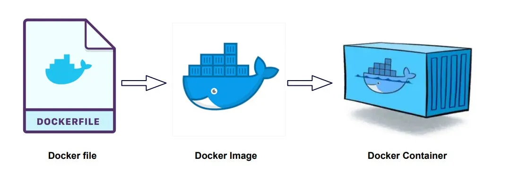
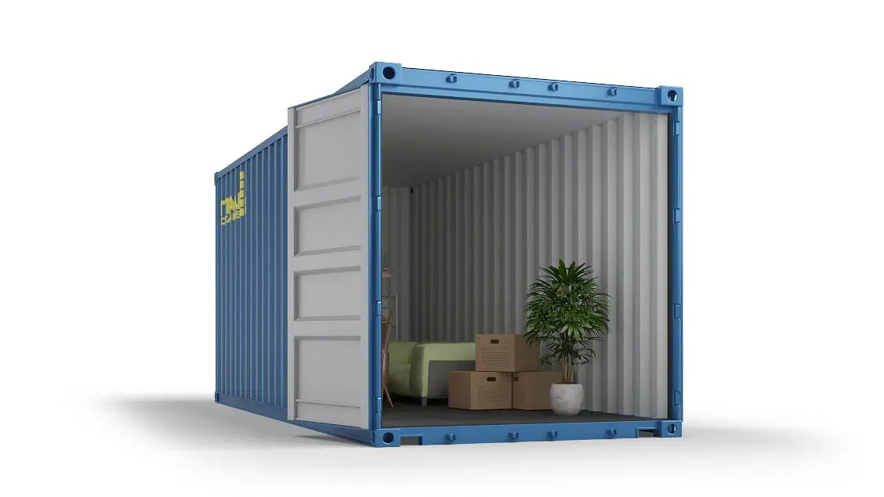
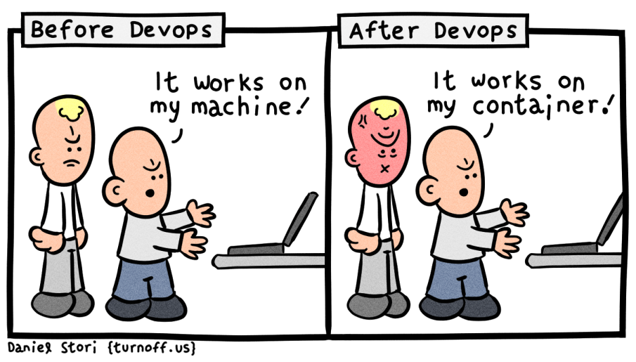
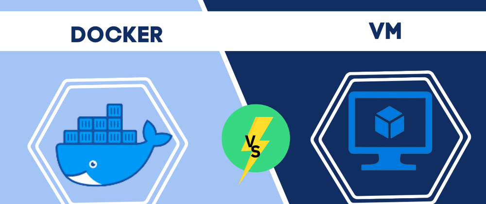
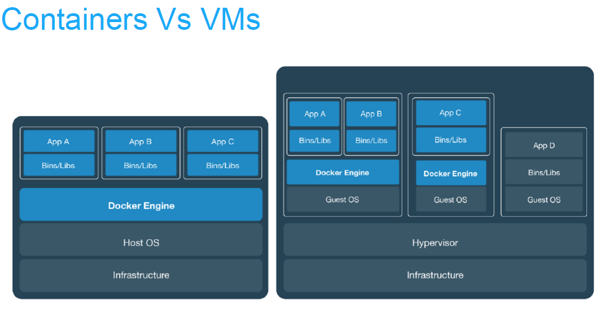

# Table of Contents

1. [Understanding Docker](#understanding-docker)
   - [What Is Docker?](#what-is-docker)
   - [Breaking Down Containers](#breaking-down-containers)
     - [The Picnic Basket Analogy](#the-picnic-basket-analogy)
     - [The Shipping Container Analogy](#the-shipping-container-analogy)
   - [Why Use Docker?](#why-use-docker)
     - [1. Consistency Across Environments - Everything Works Everywhere](#1-consistency-across-environments---everything-works-everywhere)
     - [2. Enhanced Collaboration - Teamwork Becomes Easier](#2-enhanced-collaboration---teamwork-becomes-easier)
     - [3. Managing Multiple Projects](#3-managing-multiple-projects)
     - [4. Portability - Portable and Reliable](#4-portability---portable-and-reliable)
   - [The Role of Docker](#the-role-of-docker)

2. [Virtual Machines vs Docker Containers](#virtual-machines-vs-docker-containers)
   - [What Are Virtual Machines?](#what-are-virtual-machines)
   - [How Do Virtual Machines Work?](#how-do-virtual-machines-work)
   - [Problems with Virtual Machines](#problems-with-virtual-machines)
     - [1. Too Much Baggage](#1-too-much-baggage)
     - [2. Performance Issues](#2-performance-issues)
     - [3. Harder to Share](#3-harder-to-share)
   - [How Are Docker Containers Different?](#how-are-docker-containers-different)
     - [1. No Extra Operating System](#1-no-extra-operating-system)
     - [2. Lightweight and Fast](#2-lightweight-and-fast)
     - [3. Easier to Share and Rebuild](#3-easier-to-share-and-rebuild)
   - [A Simple Analogy](#a-simple-analogy)
     - [Virtual Machines: A Full Apartment](#virtual-machines-a-full-apartment)
     - [Docker Containers: A Backpack](#docker-containers-a-backpack)
   - [Comparing Virtual Machines and Containers](#comparing-virtual-machines-and-containers)
   - [Why Containers Are Better for Most Tasks](#why-containers-are-better-for-most-tasks)

3. [Docker Components Overview](#docker-components-overview)
   - [Docker Engine](#docker-engine)
   - [Virtual Machine (VM)](#virtual-machine-vm)
   - [Docker Desktop](#docker-desktop)
   - [Command-Line Interface (CLI)](#command-line-interface-cli)
   - [Docker Hub](#docker-hub)
   - [Docker Compose](#docker-compose)
   - [Kubernetes](#kubernetes)

4. [Conclusion](#conclusion)

---

# Understanding Docker

Building software can sometimes feel like trying to bake a cake in someone else’s kitchen. Your recipe works perfectly at home, but in a new kitchen, you might not have the right ingredients, tools, or oven settings. Docker solves this problem by putting everything you need into one magical box so that your "cake" turns out perfectly, no matter where you bake it.

Let’s imagine how Docker works and why it’s such a cool tool!

---

## What Is Docker?

Docker is a tool that helps  people who make software (developers) build, package, and manage containers. A container is a lightweight, portable unit of software that includes:

- **Code**: The application itself.
- **Dependencies**: Libraries and tools needed for the code to run.
- **Environment**: Configuration ensuring consistent behavior.

By using a container, you can run a program anywhere and know it will work the same, whether it’s on your computer, a friend’s laptop, or a big server in the cloud.

---

## Breaking Down Containers

A container is much like a portable toolkit. For instance, imagine building a `Node.js` application (Node.js is a JavaScript runtime used for executing JavaScript code on a server). With Docker, you can create a container that includes:

- `Your application’s source code.`
- `The Node.js runtime.`
- `All other necessary tools and dependencies.`

This ensures that the application runs the same way every time, eliminating surprises caused by differing environments or missing tools.

Let’s look at two examples to explain how containers work:

### The Picnic Basket Analogy

Imagine you’re packing for a picnic. You put everything you need; food, plates, utensils into a basket. When you get to the park, you have everything you need for a perfect picnic.

A Docker container works the same way. It packs your software with all the tools it needs, so it’s ready to run wherever you go. No missing forks, and no surprises!

---

### The Shipping Container Analogy

Think of large shipping containers used to transport goods. They are:

- **Standardized**: Fit universally on ships, trucks, or trains.
- **Isolated**: Contents don’t mix with other containers.
- **Self-contained**: Can carry specific features, like refrigeration, if needed.

Docker containers work the same way, packaging applications, dependencies, and configurations into isolated units. They can run anywhere Docker is supported—on local machines, servers, or in the cloud - ensuring consistent behavior.

---

## Why Use Docker?

Containers address critical challenges in software development and Here’s why they are so useful:

### 1. Consistency Across Environments - Everything Works Everywhere

- **Problem**: Code that works on a developer’s machine may fail in production due to mismatched dependencies or software versions.  
- **Solution**: Containers package the entire environment, ensuring the same setup in development, testing, and production.

**Example**: If your application requires Node.js 14.3, Docker ensures that version is included in the container, eliminating compatibility issues caused by differences between local and server environments.

---

### 2. Enhanced Collaboration - Teamwork Becomes Easier

- **Problem**: Team members often have different setups. One might have an older version of a tool, causing code to work for one person but not another.  
- **Solution**: Containers create a unified environment for all team members, ensuring everyone works with the same tools and configurations.

**Example**: In a project using Node.js, one developer may use Node.js 12, while another uses Node.js 14. A Docker container standardizes the environment, avoiding conflicts and saving time.

---

### 3. Managing Multiple Projects

- **Problem**: Different projects may require conflicting versions of programming languages , libraries or tools. Switching between projects often involves reinstalling dependencies, which can be tedious and error-prone.  
- **Solution**: Containers allow each project to have its own isolated environment.

**Example**: One project may need Python 2, while another requires Python 3. With Docker, each project runs in its own container with the necessary tools, allowing seamless transitions.

---

### 4. Portability  - Portable and Reliable

- **Portability**: Containers can run anywhere Docker is installed, from a developer’s laptop to a cloud server.  And because everything is packed inside the container, it always works the same way, no matter where it’s used.

- **Reproducibility**: Containers ensure applications behave identically across all environments.

---

## The Role of Docker

While containers can exist without Docker, Docker simplifies their creation and management. It has become the industry standard because it:

- Makes building containers straightforward.
- Provides tools for managing and deploying containers efficiently.
- Works across all modern operating systems.

---

# Virtual Machines vs Docker Containers

Now that we understand what Docker and containers are, let’s talk about another way to solve the same problems: virtual machines (VMs). Virtual machines were around long before Docker, but they work very differently. Let’s break it down simply, so it’s easy to understand.

---

## What Are Virtual Machines?

A virtual machine is like a computer inside your computer. Imagine your laptop running Windows, and you set up a pretend computer inside it that runs Linux. This pretend computer acts like a real one:

- **It has its own operating system** (Linux in this case).  
- **You can install software and tools on it.**  
- **You can run programs inside it.**

It’s like creating a separate computer without needing extra physical hardware.

---

## How Do Virtual Machines Work?

Here’s a simple way to think about it:

- Your real computer (called the host) runs your main operating system, like Windows or macOS.  
- On top of that, you install special software to create a virtual machine (like a sandbox).  
- Inside this virtual machine, you install another operating system, like Linux, and set it up however you like.  

This means your virtual machine has everything your program needs—tools, libraries, and the program itself—bundled together. This is similar to what Docker does with containers, but there are key differences.

---

## Problems with Virtual Machines

Virtual machines solve some problems but create new ones:

### 1. Too Much Baggage

Each virtual machine comes with a full operating system, even if you’re only using a tiny part of it. This wastes a lot of:

- **Disk Space**: Each virtual machine can take up gigabytes.  
- **Memory and CPU**: Running multiple virtual machines can slow down your computer because it’s like running multiple full computers at once.

---

### 2. Performance Issues

Since a virtual machine is like a real computer, it needs a lot of resources to run. If you try running too many virtual machines, your system might become slow or crash.

---

### 3. Harder to Share

While you can share a virtual machine setup with others, it’s not as simple. You might need to configure it manually or spend time troubleshooting to ensure it works the same on someone else’s system.

---

## How Are Docker Containers Different?

Docker containers solve the same problems as virtual machines but in a much lighter, faster way. Here’s how they’re different:

### 1. No Extra Operating System

- **Containers share the operating system of the host computer.**  
- Instead of installing a full new operating system, they only include what the program needs (like Node.js or Python).

---

### 2. Lightweight and Fast

- Containers use minimal resources, so you can run lots of them without slowing down your system.  
- They start almost instantly because there’s no bulky operating system to boot up.

---

### 3. Easier to Share and Rebuild

- Containers can be described in a simple configuration file or saved as an image.  
- These files are small and easy to share, making it simple for others to recreate the same container on their systems.

---

## A Simple Analogy

- **Virtual Machines: A Full Apartment**  
  A virtual machine is like renting an entire apartment to set up a single chair. You can use the whole apartment if you want, but most of it will sit empty.

- **Docker Containers: A Backpack**  
  A Docker container is like a backpack that holds only what you need for your trip. It’s portable, lightweight, and doesn’t carry anything unnecessary.

---

## Comparing Virtual Machines and Containers

| **Feature**           | **Virtual Machines**      | **Docker Containers**         |
|------------------------|---------------------------|--------------------------------|
| **Size**              | Large (full OS included)  | Small (only what’s needed)    |
| **Performance**       | Slower (uses more memory and CPU) | Faster (minimal resources) |
| **Ease of Sharing**   | Harder                    | Easy (via files or images)    |
| **Encapsulation**     | Entire computer           | Just the app and tools        |

---

## Why Containers Are Better for Most Tasks

While virtual machines work well in some cases (e.g., testing an entirely new operating system), they are often too heavy for tasks like running an app. Containers are faster, more efficient, and easier to use for most software development needs.

With Docker, you can:

- Create lightweight containers.  
- Easily share and rebuild them.  
- Run multiple containers on the same system without slowing it down.

---

# Docker Components Overview

---

## Docker Engine

- The core of Docker.
- **Responsibilities**:
  - Running containers.
  - Creating containerized environments.

---

## Virtual Machine (VM)

- On **Windows** and **macOS**, Docker uses a lightweight VM to host Linux.
- **Reason**:
  - These operating systems don’t natively support Docker.

---

## Docker Desktop

- Simplifies Docker setup and management.
- **Includes**:
  - **Daemon**: Runs Docker in the background.
  - **Command-Line Interface (CLI)**: Used to create and manage containers.

---

## Command-Line Interface (CLI)

- The primary tool for interacting with Docker.
- **Use Cases**:
  - Running commands.
  - Creating images.
  - Managing containers.

---

## Docker Hub

- A cloud service for hosting and sharing Docker images.
- **Note**:
  - Will be used later in the course.

---

## Docker Compose

- A tool for managing **multi-container projects**.
- **Purpose**:
  - Helps set up and orchestrate complex environments.

---

## Kubernetes

- A powerful tool for managing and deploying containerized applications.
- **Target Audience**:
  - Especially useful for large systems.
- **Note**:
  - Will be covered in-depth later in the course.

---

## Conclusion

Docker is like a magic toolkit for your software. It organizes everything your application needs into one portable package, solving challenges like inconsistent setups and complex team collaboration. Whether you’re working on a solo project or with a team, Docker makes development faster, easier, and far less frustrating.

Just like a picnic basket or a shipping container, Docker ensures you have everything ready to go, no matter where you need to run your application.

While both virtual machines and Docker containers offer isolation, containers are the smarter, faster, and lighter option for most developers. By removing the heavy baggage of a full operating system, containers focus only on what’s essential, making them the modern, efficient way to keep your software running seamlessly anywhere.

Next let's install Docker following install.md